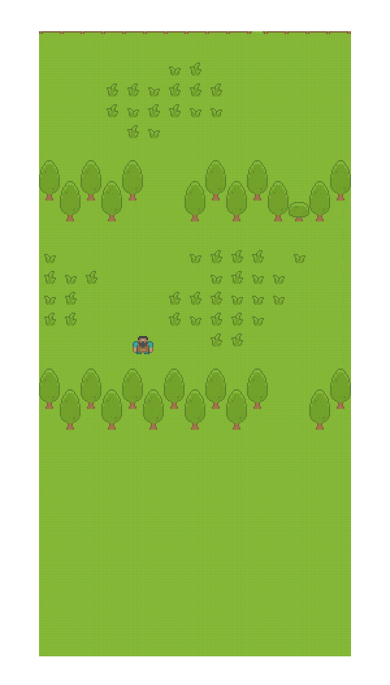

You can visually see the issue in this gif. Notice the black lines that appear as the camera scrolls town the tilemap.



This phenomenon is called "Pixel Bleeding". Its caused by the GPU sampling a pixel outside of bounds of the texture, due to floating point rounding errors.

You can resolve this by adding an extra row/column of pixels around the edges of a given tile that matches the original tile border. This way, when a floating point error occurs and the GPU samples a pixel originally outside of the texture, you'll still see the correct pixel.

[Tile Extruder](https://github.com/sporadic-labs/tile-extruder) is a node library that gives you a CLI interface to add that extra one pixel border around tilesets. This library was specifically designed around Phaser and Tiled and has specific instructions in its readme for integrating those two.

The margin on your new tileset will be increased by 1 pixel, and the spacing will be increased by 2 pixels when compared to the original.

## examples

```bash
npm i tile-extruder --save-dev
```

```bash
npx tile-extruder --tileWidth 16 --tileHeight 16 --spacing 1 --input rawAssets/spritesheets/roguelikeSheet_transparent.png --output assets/spritesheets/roguelikeSheet_transparent.png
```

## sources

- http://rotorz.com/unity/tile-system/docs/edge-correction
- https://github.com/sporadic-labs/tile-extruder
- https://twitter.com/coffeefueledfem/status/1048733807728373760
