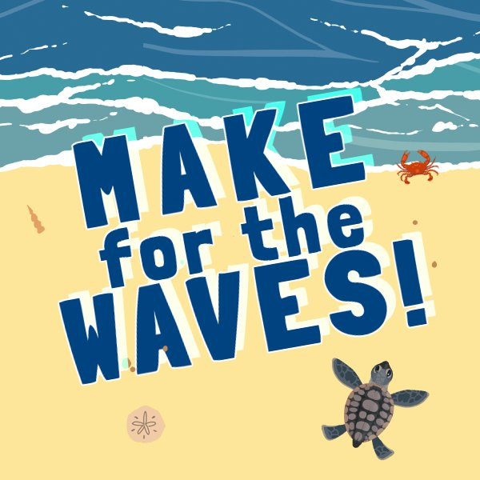
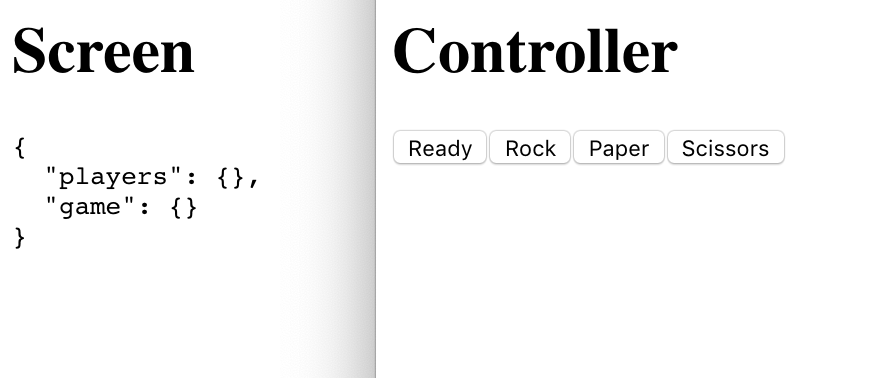
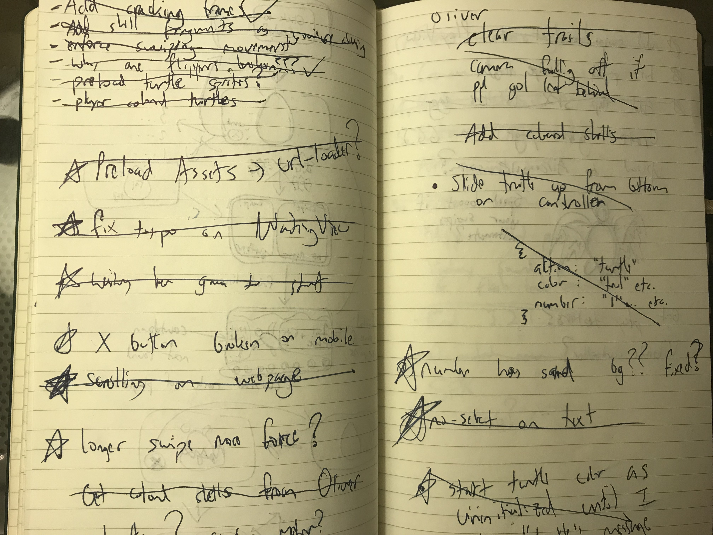

# Jam With a Plan

The more game jams I enter, the more my jam objectives have changed. Early on, I was motivated to learn how a game could be built at all. Then I wondered how to build something with a team. Lately, I've been trying to figure out how to make something that is finished and polished.

Previously, I'd been joining as many jams as I could handle. I thought this would let me practice finishing more games, but I no longer think that's the best strategy. Global Game Jam was the first jam I've done as a more slow paced deliberate process, where the jam weekend itself was merely the finale. This more intentional process feels way more effective.

## Make for the Waves!

For Global Game Jam 2019 we created a local multiplayer game called "Make for the Waves!" In the game, you and your friends play as baby turtles hatching on a beach and scampering towards their ocean home. Your turtles are controlled by inputing a swiping gesture on your smartphones to mimic the motion of baby turtles walking. The first player to reach the ocean wins the first place ribbon! But don't worry, you'll have a chance to steal the ribbon back in the next round.

This game was made using a technology called Air Console, a platform that allows you and your friends to play games in your browser while using your phones as gamepads.

<blockquote class="twitter-tweet" data-lang="en">
We finished &quot;Make for the Waves!&quot; Its a local multiplayer turtle racing game built using <a href="https://twitter.com/AirConsole?ref_src=twsrc%5Etfw">@AirConsole</a> for <a href="https://twitter.com/hashtag/GGJ19?src=hash&amp;ref_src=twsrc%5Etfw">#GGJ19</a>! Check out one of our play throughs of the final version! Made with <a href="https://twitter.com/LiaSnyde?ref_src=twsrc%5Etfw">@LiaSnyde</a> <a href="https://twitter.com/KavanBahrami?ref_src=twsrc%5Etfw">@KavanBahrami</a> <a href="https://twitter.com/EzraSandzer?ref_src=twsrc%5Etfw">@EzraSandzer</a> <a href="https://twitter.com/all_iver?ref_src=twsrc%5Etfw">@all_iver</a> <a href="https://twitter.com/Gigalithic?ref_src=twsrc%5Etfw">@Gigalithic</a> &amp; <a href="https://twitter.com/PIGSquad?ref_src=twsrc%5Etfw">@PIGSquad</a>.<a href="https://t.co/fiGskhVu1b">https://t.co/fiGskhVu1b</a> <a href="https://t.co/Ymv9shOxYE">pic.twitter.com/Ymv9shOxYE</a>
&mdash; Ryan Kubik (@ryrykubes) <a href="https://twitter.com/ryrykubes/status/1089723719453310976?ref_src=twsrc%5Etfw">January 28, 2019</a></blockquote>

# Prepare to Jam

Because a game jam is a self contained weekend project, I initially thought that taking time to prepare beforehand was wrong. I was under the perception that I was cheating or worrying too much about being "successful".

However, games jams are best when you go into them on your own terms. For me this means spending a few evenings doing some loose planning in the weeks leading up to a jam to minimize the frustrations I have during the weekend.

## Reduce Your Jam Weekend Technical Surprises

I don't find the game jam environment conducive to learning a new technical skill. In the past I would go into jams wanting to learn how to use a new physics engine or game development framework I'd never touched. I always regretted this decision when part way through the jam I got stuck.

Hitting a roadblock while learning a new technique or tool is quite common, even a good thing. Its a sign that you're learning. When these inevitable moments arise, I find the best answer is to get some space from the issue. Frequently, taking a nice long break will allow you to return with a fresh perspective and solve the problem.

The issue lies within the time constrained nature of a game jam. This usually means you cannot afford to "waste" the time you would otherwise use to take a break. Sometimes you can weather the surprises with a cut in scope, but often times you'll run out of time to finish your project.

### Technical Preparations

For Global Game Jam 2019, my team decided to use Air Console, a technology we'd never used before. Since we were unfamiliar with the framework we investigated it a couple weeks before the jam.

We studied their [developer documentation](https://developers.airconsole.com/#!/getting_started). Then put together a super bare bones rock paper scissors game as a ["proof of concept" project](https://github.com/rmkubik/airconsole-poc) in an evening.

A screenshot of the proof of concept project

This project was barely a playable game, as it focused on the aspects of Air Console we were unfamiliar with. This included creating a web-hosted touch based controller, experimenting with how to pass data efficiently via websocket messages, and Air Console's API functions.

After this, we spent another couple of hours on an [Air Console provided test Unity project](https://developers.airconsole.com/#!/guides/unity) to make sure we understood the actual development environment we would use for the jam. This allowed us to make sure we could integrate the web controller with Unity and that we'd have no issues with network configurations.

## Prepare Some Game Ideas

Aside from technical problems that can stop a jam dead in its tracks, getting a team to agree on a single game idea is the second biggest issue I run into. In an attempt to smooth out this decision process we brainstormed Air Console specific ideas over tea one evening before the jam.

Air Console presents unique opportunities for game ideas since each player has their own private touch screen. It excels at delivering secret information to players. Phones can also allow for tactile inputs, like swipes and gestures, that traditional gamepads do not.

Whenever I try to come into a game jam with an idea for a project, the theme always shoots a hole in it. This jam was no exception, but I still think the planning ideas beforehand was helpful for coming up with a workable idea quickly during the jam.

# Project Management

## Committing to an Idea & Plan

The theme for Global Game Jam this year was "What does home mean to you?" Many of our premeditated ideas did not fit in with this theme. Thankfully, we had identified what types of ideas might work on Air Console, so we were able to invent some new ideas fairly easily.

After we had a short list of three or so ideas we began evaluating how successfully each could be executed in a single weekend. There were three main criteria on which we judged each idea on.

- Was the vision of the idea clear and able to be communicated?
- Is this clear vision of small enough scope to finish before Sunday?
- Were all of us excited by the idea?

### Making Sure the Idea's Vision was Clear

Working with a group of people is great because you get to have a lot of unique perspectives and talents. But because you've got this large pool of different viewpoints, it becomes tricky to make sure everyone is on the same page.

To combat this natural tendency of groups we tried to nail down each idea's actual implementation details. Basically, any time there was a vague statement we challenged each other to clearly articulate the concept.

This involved describing gameplay verbally, in detail such as:

> "The player will swipe their fingers on the phone to make each of their turtle's legs propel them forward."

Or:

> "The players will all spawn in a nest on one side of the screen and move up toward the ocean."

We also diagramed level layouts:

<blockquote class="twitter-tweet" data-lang="en">
Getting some rough sketch ideas going for <a href="https://twitter.com/hashtag/ggj19?src=hash&amp;ref_src=twsrc%5Etfw">#ggj19</a> at the <a href="https://twitter.com/PIGSquad?ref_src=twsrc%5Etfw">@PIGSquad</a> jam site! <a href="https://t.co/hudiX1M2y1">pic.twitter.com/hudiX1M2y1</a>
&mdash; Ryan Kubik (@ryrykubes) <a href="https://twitter.com/ryrykubes/status/1089047366110404608?ref_src=twsrc%5Etfw">January 26, 2019</a></blockquote>

And how our phone-controllers would iterate through UI states:

<blockquote class="twitter-tweet" data-lang="en">
Diagraming UI flows for <a href="https://twitter.com/hashtag/GGJ19?src=hash&amp;ref_src=twsrc%5Etfw">#GGJ19</a>! <a href="https://twitter.com/PIGSquad?ref_src=twsrc%5Etfw">@PIGSquad</a> <a href="https://t.co/7n66d1JN8h">pic.twitter.com/7n66d1JN8h</a>
&mdash; Ryan Kubik (@ryrykubes) <a href="https://twitter.com/ryrykubes/status/1089286766903713792?ref_src=twsrc%5Etfw">January 26, 2019</a></blockquote>

We even watched some real life footage of turtles crawling:

<iframe width="560" height="315" src="https://www.youtube.com/embed/T8eGw1oyYoQ?start=26" frameborder="0" allow="accelerometer; autoplay; encrypted-media; gyroscope; picture-in-picture" allowfullscreen></iframe>

We still didn't end up exactly on the same page, but we were at least in the same book rather than on opposite sections of the library. We had different views of what a swipe would look like, and made different assumptions on other aspects of the game. But they were all close enough that a single game emerged.

### How Big is the Scope?

If you ask any game jam veteran they'll all tell you to cut your scope and then cut it again. Its by far the most common issue jammers run into. Even though I know to watch out for it, I don't seem to be getting much better at guessing what I'll finish in a weekend.

What I have gotten better at is chopping my over-blown scope into manageable chunks. For a jam idea to be successful, the smallest playable chunk of your idea must be almost trivial. Ideally, you should be able to finish it on the first night.

<blockquote class="twitter-tweet" data-lang="en">
We got <a href="https://twitter.com/AirConsole?ref_src=twsrc%5Etfw">@AirConsole</a> working for <a href="https://twitter.com/hashtag/GGJ19?src=hash&amp;ref_src=twsrc%5Etfw">#GGJ19</a>! Ran into some Wifi snafus, but its all sorted now! 🐢🐢🐢 <a href="https://t.co/SXCyl0VuGj">pic.twitter.com/SXCyl0VuGj</a>
&mdash; Ryan Kubik (@ryrykubes) <a href="https://twitter.com/ryrykubes/status/1089097117736435713?ref_src=twsrc%5Etfw">January 26, 2019</a></blockquote>

Our progress at the end of Friday

Beyond that first milestone, you should be able to plot out many more small steps of polish. After finishing any of these milestones your game should still be in a "shippable" state. This means that if you're part way through an iteration and the deadline is looming you can reset to your last milestone and publish your project.

### Is Everyone Excited?

Excitement was easiest to judge. We confirmed it by checking with everyone at the table as we cleared up design questions. If someone didn't like the direction an idea was headed in, we'd either rewind some core decisions or scrap the idea entirely.

## Staying on Track

### Make lots of Lists

It is incredibly helpful to make sure everyone on the team knows what work they need to accomplish now and what to start on next. This is especially true as you get further into a game jam and the reality of working for the past 24 hours starts to set in.

Having a maintained set of tasks reduces the amount of time you spend staring blankly at the ceiling or forgetting which section of the map needed an extra crab to dodge. Also, if you're taking breaks to sleep and eat (you really should!) the task list helps you jump back into working more quickly.

Our task list manifested as a series of feature ideas or bugs to squish scrawled on notebooks, messaged in Slack, and dropped in Google Drive Sheets. We also created lists of art assets, animations, and sound effects needed as new features got implemented.

Some of our tasklist scrawlings

As the jam went on we continually checked in with each other to see how everyone was doing. When we finished one task we'd scratch it out, give it a short play test, and take on a new task.

### Playtesting & Sharing

Whenever we built out a new feature iteration we had everyone else on the team, who wasn't in the middle of concentrating on something else, check it out. This internal playtesting served a couple important purposes.

The more obvious benefit is that it allowed whoever implemented the feature to see how well it worked for other people. Having somebody with fresh eyes play your latest iteration will quickly point out assumptions you've engrained while building.

Additionally, sharing with your teammates helps them to keep motivated. Seeing your game start to take shape gives you that extra boost you need to push through your own work. I believe this is especially important for teammates unable to build the latest version of the game themselves. They're frequently in a position where they can feel disconnected from the project without updates.

A useful way to hold your team accountable to keeping the game playable is to regularly share progress updates on social media, such as Twitter. More important than accountability, though, are the side benefits sharing encourages.

When you know you need to record some gameplay soon, it helps you keep your game in a playable state. We were also motivated to work on "polish" features that would help our recordings look more impressive. These types of changes often get put by the wayside, but you need them for your game to read well online. You can't be there in person to explain away all the imperfections.

You also need to actually play your game to share a recording of it. This makes sure you're playtesting at least as often as you're sharing your progress.

We tried to share at least one update before we went to bed each day, but got to show off iterations even more frequently. This was mainly possible due to the iterative approach we committed to during the first day.

<blockquote class="twitter-tweet" data-lang="en">
One last play through of our Saturday progress before we head to bed! See upi tomorrow!  <a href="https://twitter.com/hashtag/GGJ19?src=hash&amp;ref_src=twsrc%5Etfw">#GGJ19</a> <a href="https://twitter.com/PIGSquad?ref_src=twsrc%5Etfw">@PIGSquad</a> <a href="https://t.co/36pB6TOquh">pic.twitter.com/36pB6TOquh</a>
&mdash; Ryan Kubik (@ryrykubes) <a href="https://twitter.com/ryrykubes/status/1089464458810781697?ref_src=twsrc%5Etfw">January 27, 2019</a></blockquote>

A playthrough at the end of Saturday, past the halfway mark

# Be Prepared!

Minimize the amount of surprises you know you'll have going into the jam. PLENTY more will show up, there's no need to bring your own. I'm going to be sticking to this mantra for my upcoming jams in 2019. I want to do fewer jams overall, but make each of them count even more! If you've got any suggestions for what's worked or what hasn't in your jam experience I'd love to hear it!
