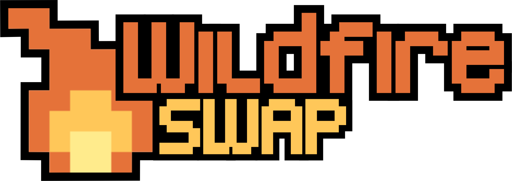
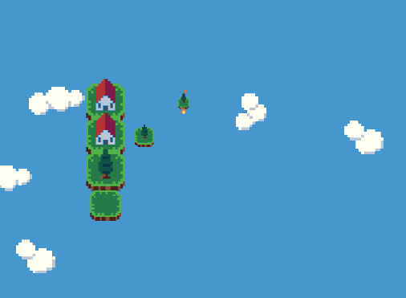
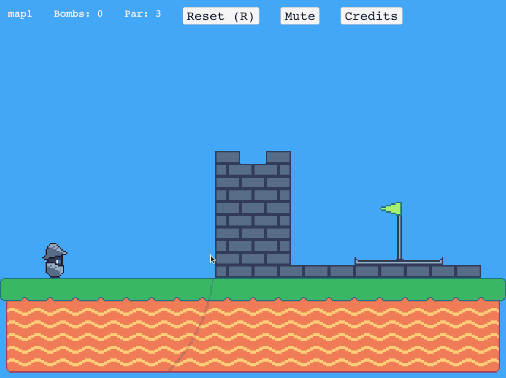
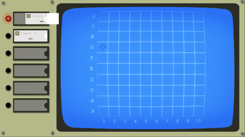

## Wildfire Swap February News

Happy leap month!

We've been meeting regularly this month to get the first draft of Wildfire Swap ready for the end of the month. There are 75 levels in the first draft that we ended up with at the end of this past month along with a ton of new audio assets. To celebrate, we're updating the demo build of the game to include a sampling of some of the new levels and audio.

🔥 [Learn more about Wildfire Swap on our website!](https://wildfire.fun)

💬 [https://discord.gg/VMymDhn](https://discord.gg/VMymDhn)

### New Demo, New Levels

Your demo download link will bring you a new build of Wildfire Swap. The levels in the main sequence are the ones we brought to our latest showcase at the Oregon Museum of Science and Industry (OMSI). If you missed that event, you'll be in for a lot of new levels.

If you got the chance to play at OMSI, don't worry! We have some new levels for you too! There are now six challenge levels at the end of the demo build. We chose them to show off some of the more complicated aspects of the game that are out of scope in the normal demo flow.

Let us know what you think [in the Discord](https://discord.gg/VMymDhn) or [on Twitter!](https://twitter.com/ryrykubes)

### Let There be Audio!

As you're checking out the new demo, you'll notice something unusual for Wildfire Swap. There is sound now! We've put off implementing the great audio Wes has been making for too long. You'll hear tile clicks, fire spread, victory chimes, and more!

The big one of course is the main theme track playing over it all. This is the original composition Wes created for us with a few touch ups. There are several more tracks (and subtle variations on those tracks) that Wes is working on too. We can't wait to get those into the game as well!

### The First Draft

Last newsletter, I talked about how we were planning on getting the first draft of the content for Wildfire Swap done by the end of February. We did it!

There are 75 levels in this first draft of content Drew put together. He introduced some new exciting challenge worlds we weren't sure would make it in. They delve into some more niche mechanics that we felt didn't fit along the main path of the game.

This clocks us in at five main path worlds and five challenge worlds. Each of these focuses on one or two mechanic interactions. On top of that, there are two less focused bonus worlds. We're planning to keep filling these bonus worlds with one-off interesting levels that don't belong elsewhere in the game.

We're excited to start getting some folks play-testing this build from beginning to end soon!

## Other Stuff

February is the first month in a little while I got to stay in Portland the entire time. It has been nice to make it to a lot more local events and get a little more work done than usual. In addition to working on Wildfire Swap, I worked on a couple small game projects over the month.

### Phaser Game Jam 2020 - Hoisted

I discovered that [Newgrounds](https://www.newgrounds.com/collection/phaserjam2020) was hosting a game jam for projects using [Phaser.js](https://phaser.io/) (one of the tools I use to make Wildfire Swap). I decided it would be a nice break to take a couple days and put together a quick entry. [I created a physics-based puzzle game called "Hoisted".](https://www.newgrounds.com/portal/view/748069) You take on the role of a medieval soldier blasting your way past enemy defenses. Click the screen to cause an explosion and propel yourself in the opposite direction.

### AirConsole Contest Entry - Warships!

I participated in another contest in February with my friend Oliver to use [the local multiplayer platform AirConsole](https://www.airconsole.com/). It allows you to play local multiplayer games with your friends using your phones as controllers. Last year, we made a game called [Make for the Waves](https://www.airconsole.com/play/sport-games/make-for-the-waves) with some other friends and wanted to try our hand at it again this year.

This year our game is called "Warships!". It is a take on adapting the classic board game Battleship for the AirConsole platform. We're excited to polish this game up a little more before the contest deadline and explore some new feature ideas if it does well.

