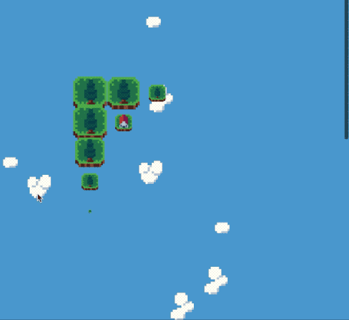
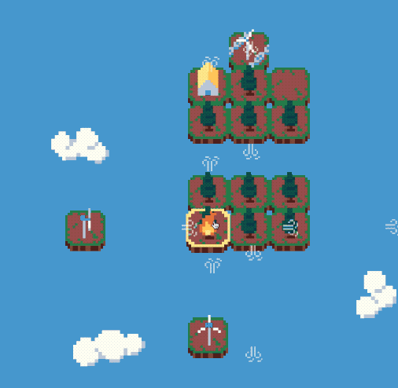
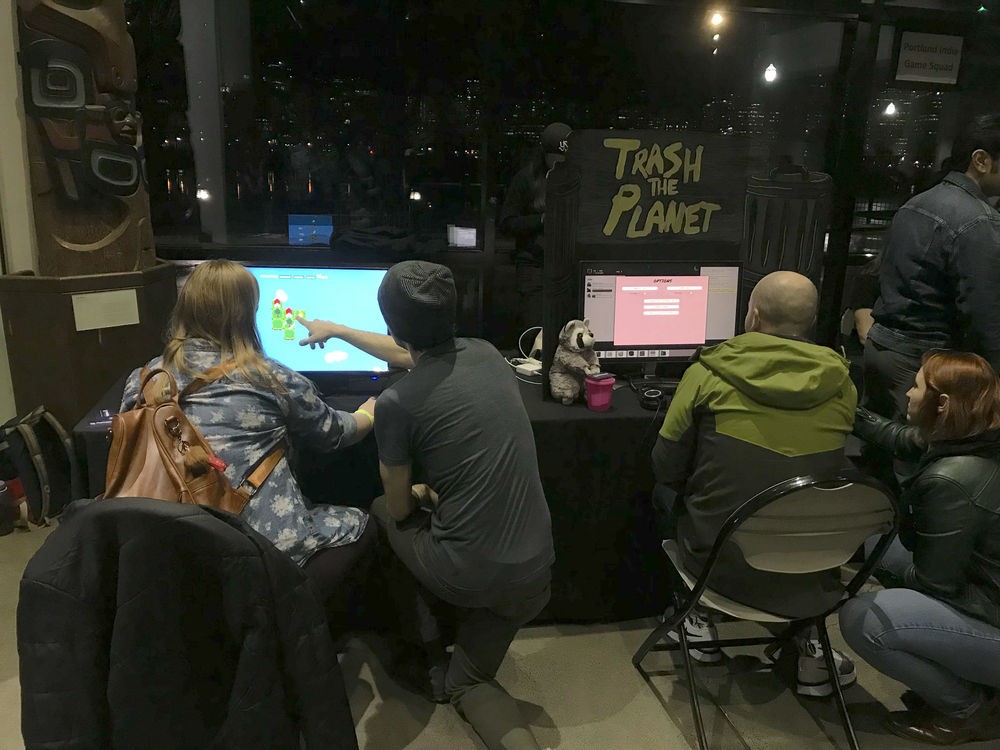
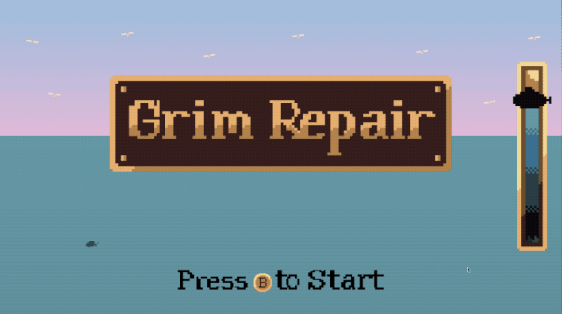

Hope your first month of 2020 is going well!

We're getting back into the swing of things putting Wildfire Swap together. We're on track to have our first rough draft of all the content in the game ready by the end of February! Currently, Drew is working hard to nail that down. I'm working on little polish additions and our final mechanic additions. Wes is working on getting us some new SFX ready!

🔥 [Learn more about Wildfire Swap on our website!](https://wildfire.fun)

💬 [https://discord.gg/VMymDhn](https://discord.gg/VMymDhn)

### First draft at the end of February

Drew has been plugging away at building interesting puzzles that explore some of the final mechanics we'll have in the game. We have 70 levels in the current draft of the main part of the game, with a few areas still left to fill out.

At the end of last year, we were planning to spread this across 5 main worlds and 2 bonus worlds. Instead, its looking like we're going to add around 3 advanced worlds to the mix. These will showcase some of the more interesting and complicated interactions in Wildfire Swap. These interactions are usually a little too challenging for us to put in the main path of the game, but they're not wild enough to move into a bonus world.

### New fire spread animation

I've been working on a lot of systems programming in the background. However, I'm occasionally adding little tweaks to improve the readability of the game. One of these tweaks is a little more polished fire spreading animation.

We're still planning to add a few more special case animations for the different types of fire spreading. But we think that this will make it clearer for new players to understand what caused a house to burn down.

### Shared new animations at OMSI

Toward the end of January we were able to bring Wildfire Swap out for a test drive! There is a science museum called Oregon Museum of Science & Industry in town. We were able to show Wildfire Swap to a non-games crowd there thanks to our local game non-profit PIGSquad.

It was helpful to run some of our new animations for some strangers. It's especially useful to show them to folks less familiar with gaming conventions. Our current animations made some players think they could race the flames if they swapped quickly enough! I'm going to work on refining the animations further so people realize they can take all the time they need to think.

## Other Stuff

I spent a little too much time traveling in January. I had a couple personal weekend trips and then one longer work trip that really ate into my month. I found it really hard to get back into a good rhythm after my winter break. Towards the end of the month, I've started to get back on track a bit.

### Global Game Jam 2020 - Journey aboard the "Grim Repair"

Every year since 2018 I've participated in an event called [Global Game Jam](https://globalgamejam.org/what-game-jam). Its a challenge to create a game in 48 hours over the weekend based on a theme. This year the theme was "repair".

My team of six created an up to [4-player local co-op game called "Grim Repair"](https://drewtooroo.itch.io/grim-repair). Its about the maiden voyage of a submarine that's started taking on water. Your crew must rush around the ship patching up leaks in order to resurface and not drown beneath the waves.

This was the first time I've participated in a game jam where I did not write a line of code. Instead I helped Drew (the level designer on Wildfire Swap!) make all the pixel art for the game and did level design.

It was a ton of fun making something come together over a weekend!

### January Blog Post - A Review of 2019 and a Plan for 2020

Each year I like to do [a personal retrospective post](https://ryankubik.com/blog/personal-retrospective-2020/) where I look back on my previous year and take some time to think about what I want out of the current year. 2020 was no different. In this post I reflect on my obsession with productivity in 2019 and how I plan to relish my self improvement process in 2020 instead.
