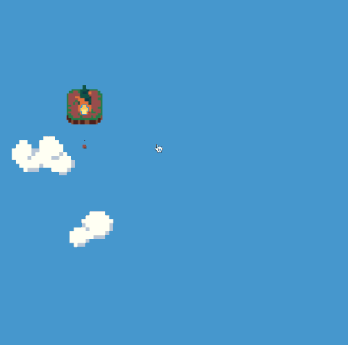
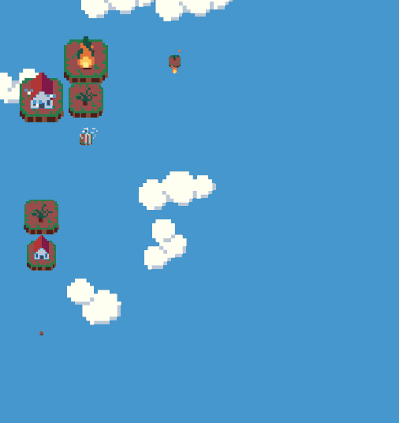
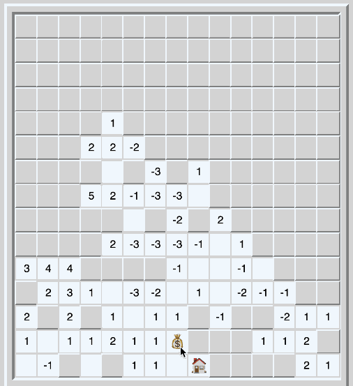
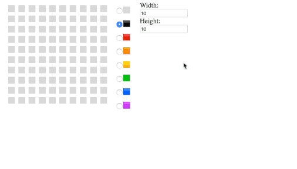

## Wildfire Swap March News

Hey everyone!

I think this has been an incredibly weird month for just about everyone in the world. We've been working on Wildfire Swap during these times but its definitely been a little more challenging than usual. Currently, we're working on tightening up the new mechanics in the advanced worlds and squashing some of our more edge case-y bugs.

The link to check out the updated demo didn't go out correctly last month, if you missed it then be sure to check it out now!

🔥 [Learn more about Wildfire Swap on our website!](https://wildfire.fun)

💬 [https://discord.gg/VMymDhn](https://discord.gg/VMymDhn)

### The Mountain Challenge Levels

Some of our later challenge worlds go on to introduce new mechanics that we felt didn't belong in the main level arc. Usually, this is because these mechanics aren't interesting unless they interact with some other mechanics. Mountain tiles are one of these mechanics we're currently introducing in the fourth challenge world.

On their own, like in the gif below, they're functionally indistinguishable from normal empty tiles. They prevent fire from spreading through them and protect the houses on the other side. However, once they're used in combination with the wind mechanic things start to get interesting. I don't want to spoil the interactions though, so I'll let you find that out for yourself after release!

### Squashing Bugs 🐛🐞

When we're not working on making new levels to showcase some of the most advanced Wildfire Swap concepts we're fixing a lot of weird bugs. As we go animate new mechanics and program new interactions between existing ones we find a lot of new scenarios that never happened before. This has caused a lot of unexpected behavior we're trying to make consistent before release.

As part of our bug fixing efforts, Drew has created test levels like the one below to ensure different advanced mechanics interact with each other correctly. As we go through and implement the new code we can make sure all of these things continue to work as expected!

## Other Stuff

It was hard to focus very well on just Wildfire Swap work this month! As the work becomes more about bug fixing and organizing content for marketing it gets more out of my wheel house. I worked on a few small development projects to help scratch that coding itch.

### 7DRL - Bombfinder RL

Every year, there is a week long game jam called Seven Day Roguelike. The challenge is to create a game in the roguelike genre in under a week. I've wanted to do give this a try for a couple years now, but this year I finally had a couple days free to try it.

I created [a weird little game called Bombfinder RL](https://rmkubik.itch.io/bombfinder) that answers the classic question, "What if Minesweeper was a roguelike?". Rather than just mines, there are also items that can help you out hidden underneath those tiles. The numbers reflect the difference between the number of harmful and beneficial tiles surrounding them. If you search long enough, you'll find the door to the next level of the dungeon.

### Emoji Picker Codepen

The latest batch of emojis shipped with some new colored squares. Until now there had only been black and white ones. [Ben Porter tweeted a challenge](https://twitter.com/eigenbom/status/1242230315684212736) to folks to create pixel art with these new emojis. I made [a little codepen creation that allows you to paint with these emoji](https://codepen.io/rmkubik/details/XWbxbvb) and copy them to your clipboard for easier sharing.

### March Blog Post - Scale and Center Pixel Art on the Command Line

[This month's blog post](https://ryankubik.com/blog/scale-center-pixel-art/) is about one of the tools I use while creating pixel art called [ImageMagick](https://imagemagick.org/index.php). It lets you edit image files by using your command line. I find this really helpful so that I can automate my workflows and iterate through image variations quickly.
