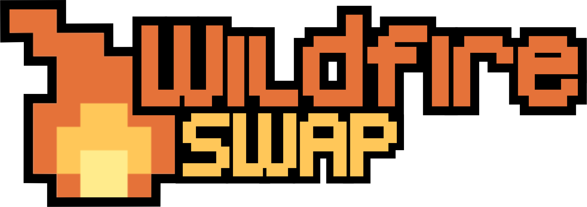

Wildfire Swap is a puzzle game about swapping tiles to prevent fires from burning down people's homes. While showing Wildfire Swap to folks, I've gotten recurring questions about what inspired this game. This post dives into that inspiration story and looks at where Wildfire Swap came from.

## The Inspiration Behind Wildfire Swap

I'm originally from West Virginia and moved out west to Portland, Oregon at the end of 2016. During my first year in Portland, Oregon I experienced my first wild fire. It was the [Eagle Creek Fire](https://en.wikipedia.org/wiki/Eagle_Creek_Fire) and it burned 50,000 acres in the [Columbia River Gorge](https://en.wikipedia.org/wiki/Columbia_River_Gorge), just outside of Portland.

The Columbia River Gorge is a beautiful, lush canyon that follows the Columbia River as it flows out of the Cascade Mountain Range and into the Pacific Ocean. The gorge is a very popular destination for hiking and other outdoor recreation for people living in the area. Additionally, the only interstate in Oregon that heads East out of the state, I-84 runs alongside the river.

Along this highway there is a must see sightseeing location called the Vista House. From here, on a clear day you can see more miles and miles. Its beautiful. I took this photo from that vantage point in early summer of 2017.

Four months later, my parents were visiting me in Portland for the first time and I wanted to share the natural beauty of my new west coast home. We travelled own I-84 to the Vista House, but the view was quite different this time.

We didn't understand what we were seeing at the time. We knew that it wasn't fog, but we'd never seen the ash cloud from a wild fire before. We drove further down the highway to see some of the trails and waterfalls up close since we couldn't see them from up high. Eventually, the air became too thick and hot so we had to turn back for Portland.

When we woke up the next day, we learned that I-84 was now closed on the stretch we had been driving on. People from towns we drove past the day before were being ordered to evacuate their homes by the state government. Even though we were miles away from the fire proper, ash was falling from the sky like snow for days.

The Columbia River Gorge continued to burn for three months before the wild fire was declared completely contained. The tireless efforts of over 1000 firefighters clearing miles of forest, shifting wind conditions, and a fortuitously timed bout of Pacific Northwest rain finally brought the fire to its knees.

Living so near this new-to-me force of nature kindled an desire in learning more, so I started researching. Wildfires are different than house fires. We can't extinguish them. We do our best to control and contain them. But they have minds of their own and frequently stopping them comes down to concentrated human effort and a lucky break in the weather.

Wildfire Swap is a game about exploring the efforts to control those massive fires. It explores how a small spark can quickly turn into a raging inferno and how easily forces of nature can spiral out of our control.

You take on the role of a wildland fire fighter. Your goal is to create firebreaks between out of control fires and people's homes by solving tile swapping puzzles. Like wild fires in the real world, you're at the mercy of the flames. You cannot extinguish them: you must do your best to contain them.

Every time you make a move to contain the fire, it spreads more out of control. Through well-planned and calculated movements you can prevent the flames from burning down homes. Each level challenges you to understand more deeply how fires spread so that you can adapt your fire prevention strategies.

I hope that people have fun playing Wildfire Swap. And I hope that as they overcome the puzzles in this game, they get some sense of the enormous amount of planning and hard work fire fighting teams put in to contain these fires.
